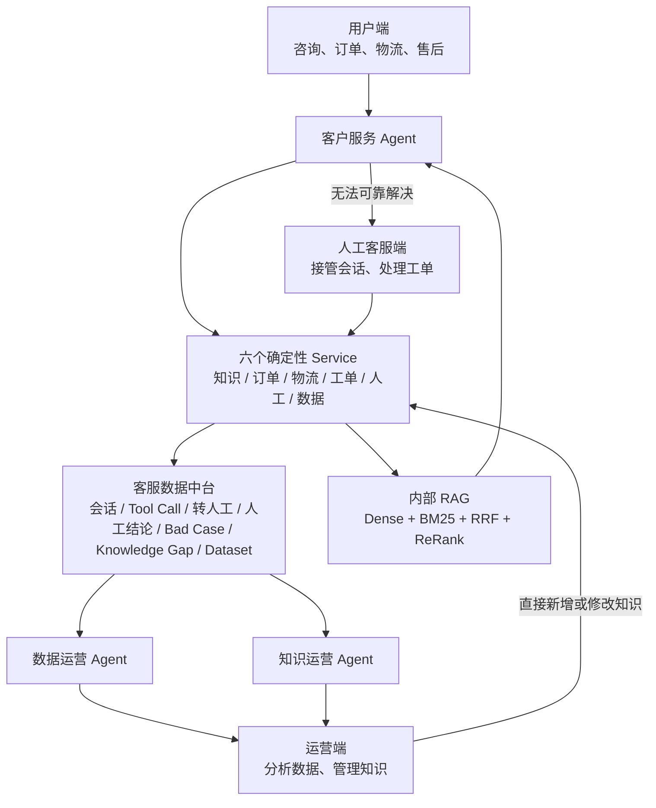

# ServiceLoop AI

> 企业 Agentic 客服运营中枢

ServiceLoop AI 不是一个单独的聊天机器人，而是一套可以完整演示企业客服业务闭环的
AI 客服运营平台。它把客户咨询、AI 处理、人工接管、数据沉淀、运营分析和知识更新
连接起来，让人工解决过的问题逐步变成 AI 下一次可以直接解决的问题。

项目最核心的闭环是：

```text
AI 客服 -> 人工客服 -> 数据沉淀 -> 运营 Agent -> 知识更新 -> AI 客服
```

## 我们要构建的产品

最终的 ServiceLoop AI 由三个使用端、三个业务 Agent、六个确定性 Service、一个
客服数据中台和一套内部 RAG 组成。



系统不会发展成很多 Agent 互相对话。Agent 负责理解目标、做判断和组织流程；订单查询、
物流查询、知识检索、工单操作等能力由行为确定、容易测试的 Service 提供。

## 三个使用端

### 1. 用户端

用户真正使用的客服聊天页面，计划入口为 `/customer`。

用户可以：

- 咨询商品、服务和售后知识；
- 查询订单状态；
- 查询物流进度；
- 咨询退款、换货和维修；
- 创建服务工单；
- 在 AI 无法可靠解决时转接人工客服。

用户不需要知道后台调用了哪个 Agent 或 Service，只需要获得连续、可追踪的客服体验。

### 2. 人工客服端

人工客服工作台，计划入口为 `/workspace`。

客服可以查看待接管会话、完整聊天上下文、用户订单、AI 已调用的工具和转人工原因，
然后直接接管聊天、创建或处理工单并结束会话。

每次 AI 转人工都必须附带一份接管包：

- 用户当前问题；
- 订单和物流摘要；
- AI 对上下文的总结；
- AI 已经调用过的 Service 和结果；
- 转人工原因；
- 建议人工继续确认的事项。

目标是让人工客服不必重新询问用户已经提供过的信息。

### 3. 运营端

客服运营后台，计划入口为 `/operations`，也是本项目区别于普通客服机器人的核心部分。

运营人员可以：

- 查询和筛选历史会话；
- 查看人工接管记录、Bad Case 和 Knowledge Gap；
- 让数据运营 Agent 分析高频失败原因；
- 查看值得加入评测集的真实案例；
- 导出 CSV 或 JSONL 数据集；
- 直接新增或修改知识并使新版本生效。

第一版不设计独立的知识审核流。运营人员确认内容后可以直接发布，系统保留知识版本，
便于查看历史和回退。

## 三个业务 Agent

### 客户服务 Agent

客户服务 Agent 是 AI 一线客服。它负责识别用户意图、选择需要调用的 Service、根据
真实证据组织答案，并判断是继续自动处理还是转人工。

它可以调用知识、订单、物流、工单和人工服务，但这些 Service 本身不是 Agent。
当知识不足、业务规则不明确、工具失败或风险较高时，Agent 应转人工而不是编造答案。

### 数据运营 Agent

数据运营 Agent 面向客服数据中台，回答运营人员的业务问题，例如：

> 最近售后问题为什么经常转人工？

它会筛选相关会话和工具调用，归纳主要原因，返回相关失败案例、知识缺失数量和改进建议。
它还负责发现高频问题、工具异常、典型 Bad Case，并协助生成评测数据集。

### 知识运营 Agent

知识运营 Agent 专门处理 Knowledge Gap。它从重复失败的会话和人工最终处理结果中，
识别当前知识库缺少的内容，并生成可供运营人员使用的知识草稿。

例如，多个用户询问“X3 Pro 是否支持 iPhone 16”，AI 因知识不足反复转人工，而人工
给出的结论一致。知识运营 Agent 应把这些会话聚类为一个 Knowledge Gap，结合人工结论
生成知识草稿。运营人员修改或确认后直接入库，下一次相似问题即可由 AI 处理。

## 六个确定性 Service

| Service | 职责 |
| --- | --- |
| Knowledge Service | 检索、添加、修改、版本化和停用知识，内部调用唯一一套 RAG |
| Order Service | 根据用户身份和订单号查询订单信息 |
| Logistics Service | 查询发货状态、承运信息和物流轨迹 |
| Ticket Service | 创建、查询、更新和关闭客服工单 |
| Human Service | 创建人工接管任务、维护排队状态和分配客服 |
| Data Service | 记录、查询、筛选和导出客服业务数据 |

Service 输出结构化结果和明确错误，不自行决定客服策略。Agent 根据 Service 结果做业务判断。

## 客服数据中台

这里的数据中台不是复杂的大数据平台，而是统一保存客服闭环中产生的真实业务数据。

第一版核心数据对象包括：

| 数据对象 | 保存内容 |
| --- | --- |
| Conversation | 用户、AI 和人工客服的完整会话 |
| Message | 单条消息的角色、内容、时间和来源 |
| Tool Call | Agent 调用了什么 Service、输入、结果、耗时和错误 |
| Handoff | 转人工时间、原因、上下文摘要和接管状态 |
| Human Resolution | 人工最终判断、处理动作和对用户的答复 |
| Feedback | 用户评价和客服内部反馈 |
| Bad Case | 失败类型、影响范围和关联会话 |
| Knowledge Gap | 缺失知识、相关案例、频率和建议草稿 |
| Dataset | 从真实案例筛选出的评测或训练数据 |

数据中台首先支持查询、筛选、查看详情、Agent 分析以及 CSV／JSONL 导出，不在第一版引入
额外的大数据组件。

## 三条必须跑通的演示链路

### Demo 1：AI 独立解决

```text
用户询问订单何时发货
  -> 客户服务 Agent 查询订单
  -> 查询物流
  -> 根据真实结果直接回复
  -> 会话和 Tool Call 写入数据中台
```

### Demo 2：AI 转人工

```text
用户询问超过 7 天的商品损坏能否换货
  -> 查询订单和售后知识
  -> 发现现有规则不足以确定答案
  -> 创建人工接管任务并附带完整上下文
  -> 客服接管并解决问题
  -> 人工结论写入数据中台
```

### Demo 3：数据飞轮

```text
多个相似问题反复转人工
  -> 人工给出一致的正确结论
  -> 数据中台沉淀会话与处理结果
  -> 知识运营 Agent 发现 Knowledge Gap
  -> 生成知识草稿
  -> 运营人员直接补充或修改知识
  -> RAG 原子切换新索引
  -> 再次提问时 AI 可以独立解决
```

第三条链路是 ServiceLoop AI 最重要的项目展示：它证明系统不仅会回答问题，还能利用
真实客服数据持续改善自己的解决能力。

## RAG 在项目中的位置

项目只保留一套 RAG，作为 Knowledge Service 内部能力运行在 FastAPI 后端中：

```text
客户服务 Agent -> Knowledge Service -> RAG
```

当前检索流程：

```text
中文或英文问题
  -> Dense 精确全量召回，O(N x 1024)
  -> 预构建 BM25 倒排索引
  -> RRF 融合
  -> Cross-Encoder ReRank
  -> 返回带来源的证据
```

第一版 RAG 的边界已经冻结：

- Dense 继续使用内存精确扫描，不提前引入向量数据库和 ANN；
- BM25 在知识变化时重建，查询时不重新构建整个语料库；
- 不使用 metadata 硬约束；
- 同时支持中文、英文和中英混合内容，当前重点保证中文资料的召回效果；
- 运营新增或修改知识后，构建完整的新 Dense 和 BM25 快照；
- 只有新快照全部构建成功后才原子切换，失败时保留旧索引；
- 每次修改生成新知识版本，不设置额外审核流程。

更详细的 RAG 决策见 [docs/rag-v1.md](docs/rag-v1.md)。

## 技术架构

第一版计划保持为一个容易启动、容易演示的模块化单体：

```text
React 三端页面
       ↓
    FastAPI
       ↓
3 个 Agent + 6 个 Service
       ↓
数据库 + 内部 RAG
```

- FastAPI 为三个使用端提供统一后端接口；
- Agent、Service、RAG 保持清晰模块边界，但暂不拆成多个微服务；
- 数据库保存客服闭环和知识版本；
- Redis 暂不作为核心依赖，后续只在确有需要时保存 Session 临时状态；
- 最终使用 Docker Compose 一次启动前端、后端、数据库和可选 Redis。

架构边界说明见 [docs/architecture.md](docs/architecture.md)。

## 目录规划

```text
serviceloop-ai/
├── backend/
│   ├── app/
│   │   ├── agents/          # 三个业务 Agent
│   │   ├── services/        # 六个确定性 Service
│   │   ├── api/             # 三个使用端的 FastAPI 路由
│   │   ├── db/              # 数据库会话和数据模型
│   │   ├── repositories/    # 数据访问层
│   │   ├── schemas/         # 请求与响应结构
│   │   └── rag/             # 唯一一套内部 RAG 和最小测试页面
│   └── tests/               # 后端、RAG 和业务闭环测试
├── frontend/                # 用户端、人工客服端、运营端
├── database/seed/           # 本地演示数据
├── evaluation/datasets/     # 评测数据集
├── evaluation/results/      # 评测结果
└── docs/                    # 架构和设计决策
```

## 当前完成情况

当前是 v0.1 项目骨架，已经完成：

- 确定三个使用端、三个 Agent、六个 Service 和一个数据中台的边界；
- 从原项目迁移并改造唯一一套内部 RAG；
- 实现 Dense、BM25、RRF 和 ReRank 检索流程；
- 实现知识动态添加、修改、版本历史和原子索引切换；
- 提供不依赖预置知识即可启动的最小 RAG 测试页面；
- 增加中英文知识与检索测试。

目前尚未实现完整三个前端、真实订单／物流数据、人工接管队列、数据中台持久化和三个 Agent
的正式编排。这些内容属于后续业务闭环阶段，不应在 README 中被误认为已经完成。

## 建议开发顺序

1. 建立 Conversation、Message、Tool Call、Handoff、Human Resolution 等数据模型；
2. 实现订单、物流、工单、人工和数据 Service 的本地可演示版本；
3. 跑通客户服务 Agent 的“直接解决／转人工”两条分支；
4. 完成人工客服工作台和接管包；
5. 完成运营端的数据查询、Bad Case、Knowledge Gap 和导出；
6. 实现数据运营 Agent 与知识运营 Agent；
7. 跑通知识更新后的数据飞轮 Demo；
8. 补充评测集、Docker Compose 和完整演示数据。

这个顺序优先保证业务闭环真实可演示，再逐步增强模型效果和工程能力。

## 启动当前 RAG 测试页面

### 密钥配置规则

项目中的所有 API 密钥只能从仓库根目录的 `.env` 文件读取，不支持从系统环境变量或
启动命令中读取。即使系统环境变量存在同名密钥，程序也会忽略它，只使用 `.env` 中的值。

这样可以让密钥配置只有一个来源，减少本地开发、测试和演示时的配置分支。项目只提交
不含真实密钥的 `.env.example`，真实 `.env` 已被 Git 忽略，不能提交到仓库。

```text
serviceloop-ai/
├── .env              # 本地真实密钥，只在这里配置，不提交
└── .env.example      # 配置项示例，可以提交
```

安装最小开发依赖：

```bash
cd backend
uv sync --extra dev
```

启动空知识库测试入口：

```bash
uv run python -m app.rag.testui
```

打开 `http://127.0.0.1:8010`。页面在没有知识资料和模型凭据时也能启动。真正新增知识前，
需要在仓库根目录 `.env` 中配置 `DASHSCOPE_API_KEY`，并安装 RAG 依赖：

```bash
uv sync --extra rag --extra dev
```

## 运行测试

```bash
cd backend
uv run --extra dev pytest -q
uv run --extra dev ruff check app tests
```

## 项目原则

- 先完成真实客服闭环，再增加技术复杂度；
- Agent 负责判断，Service 负责确定性执行；
- AI 的回复必须有知识或业务数据依据；
- 无法可靠处理时及时转人工，不用幻觉掩盖知识缺口；
- 人工处理结果必须回到数据中台，不能停留在聊天记录里；
- 运营改进必须能够重新增强 AI 客服，形成可验证的数据飞轮。
